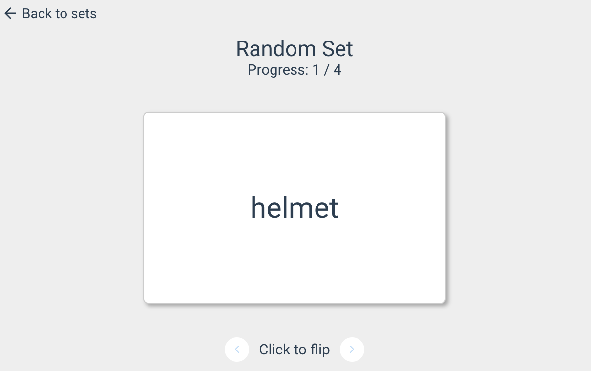

# Flash Card

Access the Flash Card activity page from a set, sidebar, or the homepage.

<!-- TODO: Get a screen shot from the landing page -->
---- TODO: Get a screen shot from the landing page ----

Select word set to study with from the dropdown.

Select whether you want to be shown the word in English, your current language, or a random mixture of English and your language first.

Click "Start" to begin the study session.

For each word in the set, there is a card that will show the selected type of words first and the card can be clicked to flip over to see the translation on the back.

The arrows at the bottom allow you to go forward and backward through the words of the selected set.

Your progress is displayed at the top with an indicator of the current card out of the total amount
