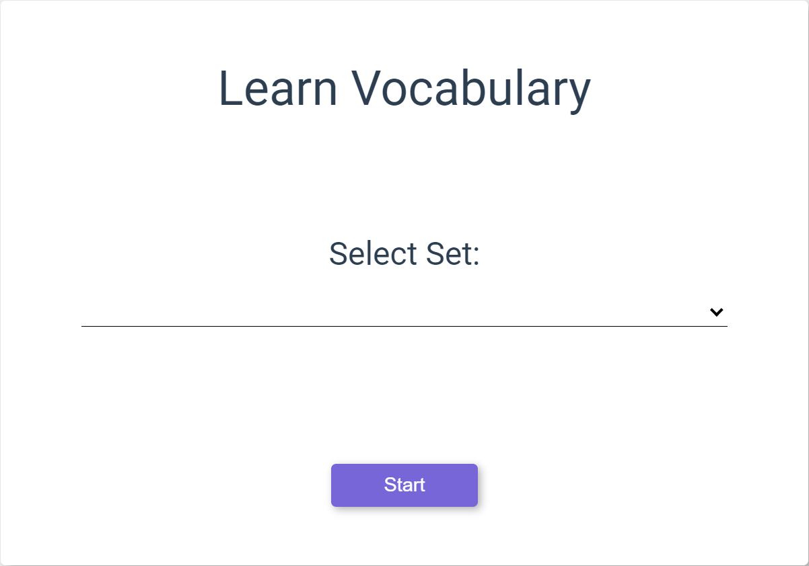
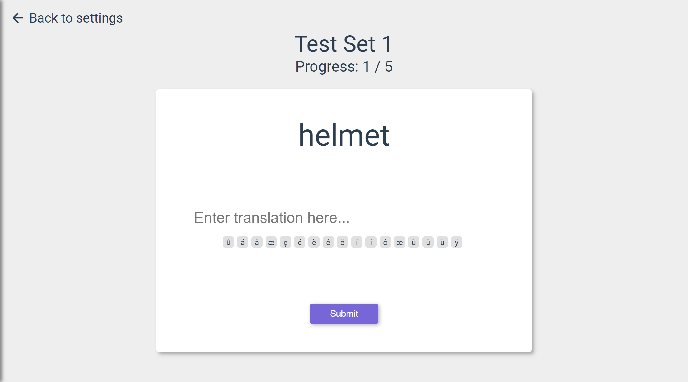

# Learn

Select Learn from the side bar at the left side of the page.

Select a set of words to practice with and the language you would like them to be presented in, then select start.

<!-- TODO: Replace this with the fully implemented version with all of the special character buttons -->
---- TODO: Replace this with the fully implemented version with all of the special character buttons ----

On the learn page you will be presented with a word from the set in the previously specified language. Type the translation into the input box below the word and click submit. For any words requring accented letters you can use the toolbar provided under the input box.

If the translated word is spelled correctly you will move on to the next word, if spelled incorrectly you can try again, or get the answer. You can skip a word at any time.

Once the set is finished, a results screen will appear to show how well you spelled the words in the set.
