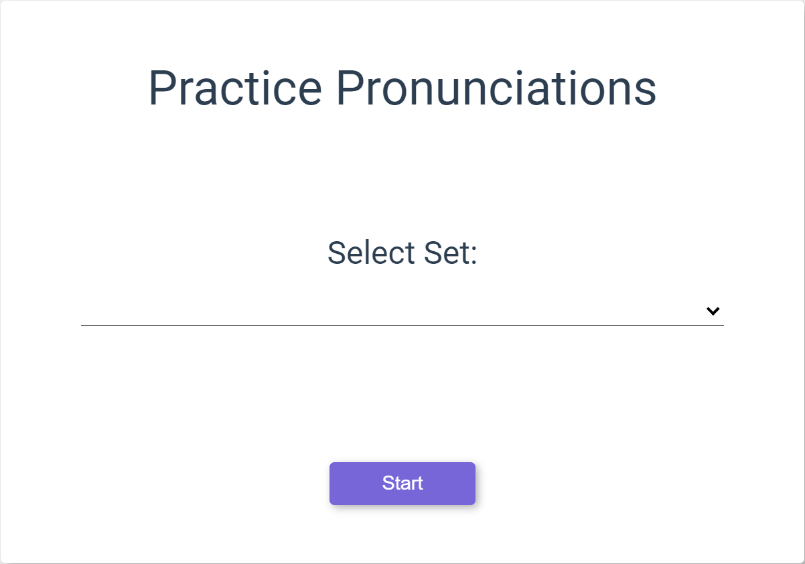
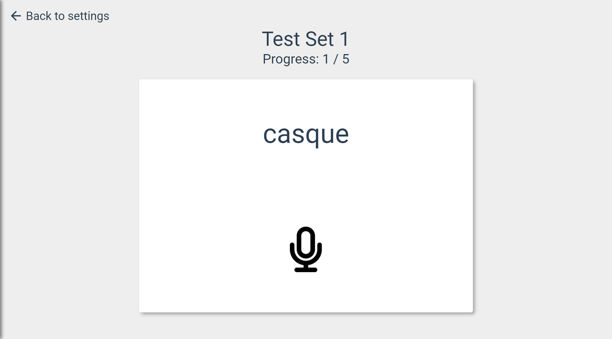

# Pronunciation

Select Pronunciation from the side bar at the left side of the page.

Select a set to practice pronouncing, select start.

A word form your set will be displayed on the page with it's phonetic spelling. Select the microphone below the word and speak the word into your microphone, if you pronounced the word correctly you will proceed to the next word in the set, if your pronunciation was incorrect you can try again by clicking the microphone.

You may skip a word at any time by selecting the "Skip" button.

A results screen will appear when you get through the set to show how well you pronounced the words in the set.
