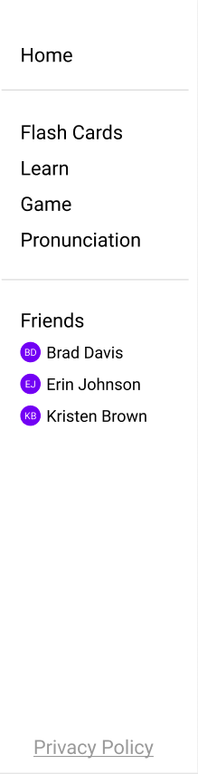

# Copy Sets Created by Other Users

Search for a user by name, username, or email or click go to the profile of a user you are currently following.

Select the heart button on one of their sets to copy it to your list of sets.

This set will now be available to use in your own activities, but you cannot edit, delete from, or add to another users set.
