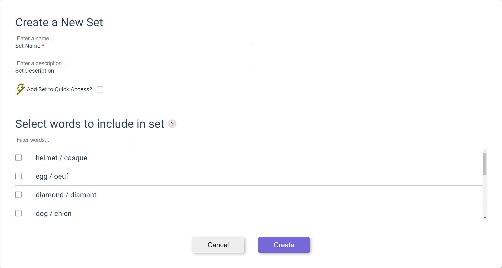

# Create Set

In the top navigation bar, click the plus button and then click "Create New Set"

Enter Set title.

Enter description of the set, if desired.

Check the "Add to Quick Access?" box to show the set on the home page for easy access after login.

You can optionally select any amount of words from your dictionary to add the new set by selecting the checkbox on the word row. Words can be filtered by typing in the filter box.

Click the submit button to create the set or the cancel button to discard the new set and return to the previous page.

Upon clicking submit, you will be prompted with a message to create new words to go in the new set. Select yes to start a new word and no to return to the previous page.
