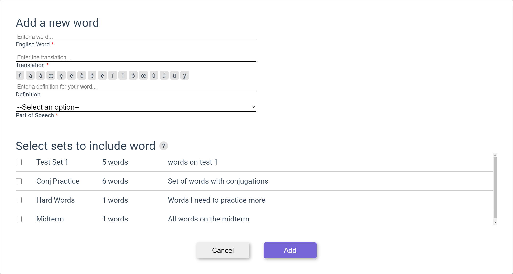
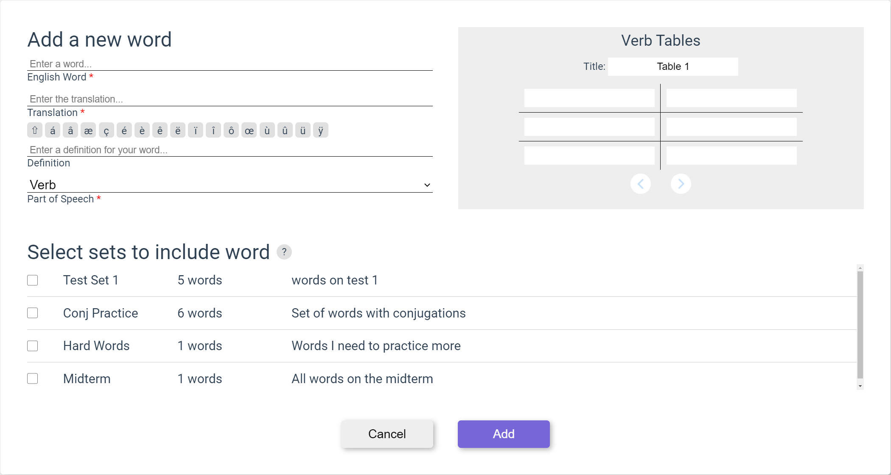

# Create Word

In the top navigation bar, click the plus button and then click "Create New Set".

Enter the English form of the word.

Enter the foreign language form of the word.

If desired, enter a definition of the word.

Select the part of speech of the word.

If part of speech is a verb, then the conjugation table is displayed to fill in conjugations for different verb tenses. Hitting the next arrow will create a new table to add a new verb tense table for the word if needed.

You can select any amount of sets to add the new word to (0 to all of them) by selecting the checkbox on the Set row. If no set is selected, then the word will only be added to your dictionary.

Click the submit button to create the word or the cancel button to discard the new word and return to the previous page.

Upon clicking submit, you will be prompted with a message to create a new word. Select yes to start a new word and no to return to the previous page.
