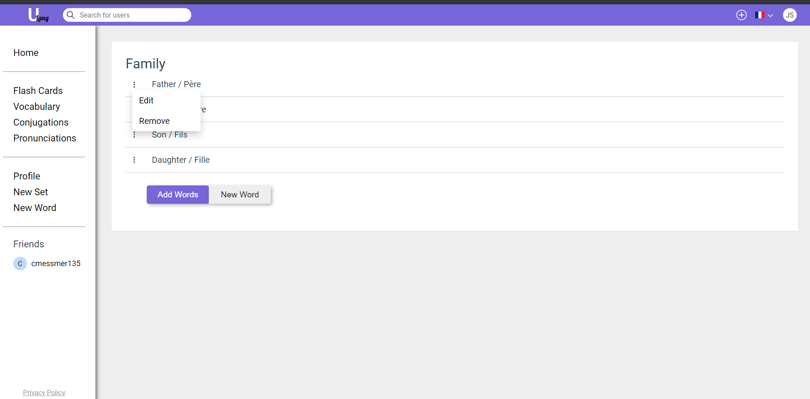

# Edit Dictionary

Select the profile button at the top right of the page to access the profile page. 

The profile page will list the sets in your dicitonary.

-  You can filter and sort your lists using the filter entry box, and sort drop menu respectively. 
- A set can be marked for quick access by clicking the lightning bolt on the set, this will add it to the quick access section on the home page. 
- Selecting a set will allow you to edit it.

On the set edit page you can view the set name and list of words.

- The set name may be changed by selecting it and editing it.

- Words can be added to the set by clicking "Add Words", words may be selected form your dictionary and added by clicking "Add". A new word may be added by selecting "New Word". 

- Words can be removed by hovering over the three dots beside the word and selecting "Remove". 

- Words can be edited by hovering over the three dots beside the word and selecting "Edit".

- Upon selecting "Edit" you can change the definition and notes for the selected word by typing in the respective fields and selecting the checkmark. You may delete the word by selectin the trashcan on the top right of the page.

