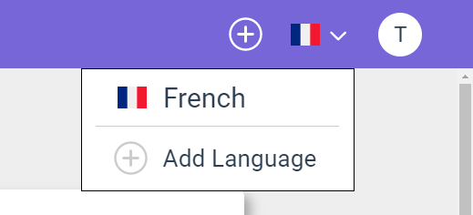
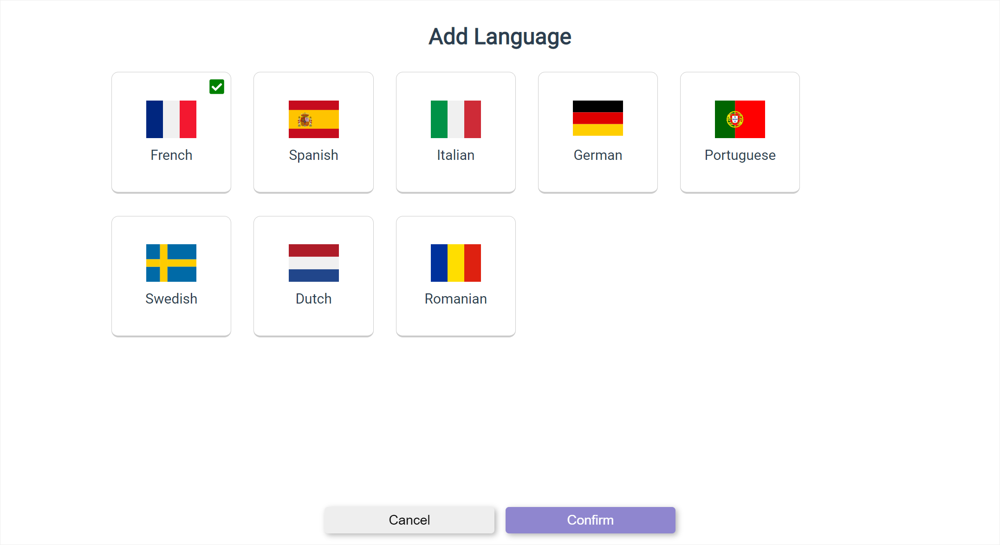

# Study Another Language

If a user would like to study another langauge besides the one they signed up with, they can add another by accessing the Add Language page by clicking on the flag displayed in the navigation bar.

The Add Language page allows the user to start creating sets and words for the new language added from the page. The language can be changed at any time by clicking on the flag on the navigation bar again.

