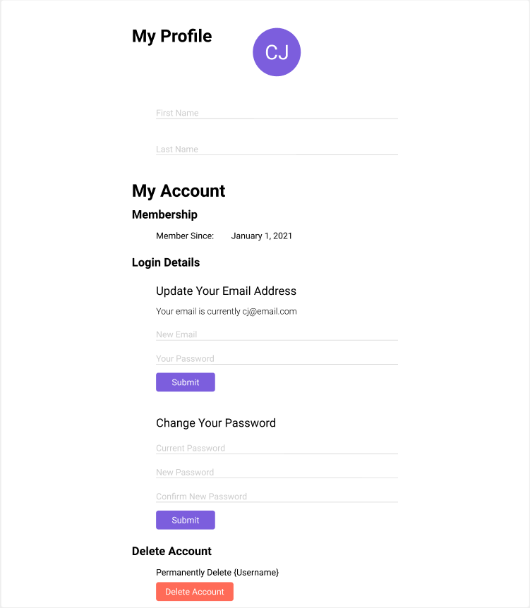

# User Settings

Navigate to the "My Profile" page by clicking on your profile icon in the top right of the page. Here you can view and modify account information.

### Example View

<!-- TODO: Update image when completely implemented -->

## Change email

Under "Update Your Email Address" enter you new email address and current password. Click Submit to update the email associated with your account.

## Change password

Under "Change your Password" enter your current password, new password, and confirm your password. Click Submit to update your password.

## Enter or change name on profile

Under "My Profile" in the "First name" and "Last name" fields, enter the name you would like to be the displayed on your profile.

## Delete Account

If you wish to terminate your account, click "Delete Account" at the bottom of the page. Confirm that you want to delete the account on the pop-up by typing your username.
